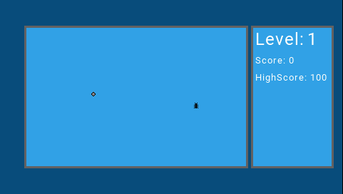

## OpenTX_Snake for TX16S/Horus/Jumper T16 - v1.1.1

### OpenTX_Snake
 Snake HD for OpenTX HD Screens

## Interface

#### Horus/TX16S view

## Features
* Works with all HD touchscreens like in a Radiomaster TX16S
* Just a fun Snake game you can play on the Controler

## Requirements

* [OpenTX v2.3.9+](http://www.open-tx.org/) running on Taranis Q X7/Q X7S,Horus X10/X10S or X12S (OpenTX v2.3.9+ is suggested)
* Radiomaster TX16S requires [Latest OpenTX Radio Firmware 2.3.9+](https://www.radiomasterrc.com/downloads) 
* The OpenTX/TX16S firmware on your transmitter needs to [includes the `luac` build option]

## TODO
* Mode 1 and Mode 2 selector in settings menu
* Saving all time HighScore
* Update the PNG to HD Pictures
* Thema's
* 